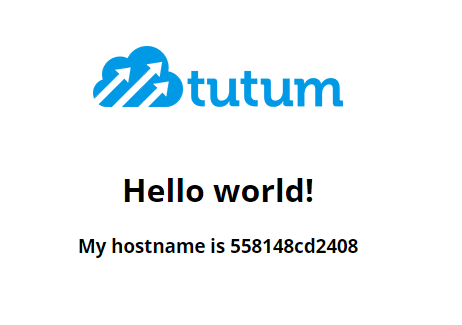
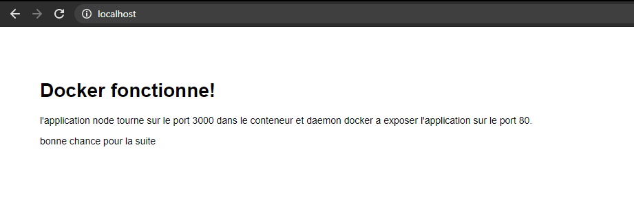

# Rendu - Labo DevOP - TP 1

## I.I - Premier lancement :

En premier lieux on install l'image :
```
docker image pull tutum/hello-world
```
On lance le docker avec la commande : 
```
docker run --name hello-world -p 5000:80 tutum/hello-world
```
Résultas sur le port 5000 :


## I.II - Docker Hello-World : 

On va d'abbord lancer conteneur docker que l'on nomme hello-world :
```
docker run -it --name helloword tutum/hello-world
```

On affiche la liste des conteneur : 
```
docker ps -a
```
On peut voir que le container est bien lancé :
```
PS C:\Users\Antonin> docker ps -a
CONTAINER ID        IMAGE                                           COMMAND                  CREATED              STATUS                       PORTS                 NAMES
e1cdbba6b2b6        debian                                          "bash"                   17 seconds ago       Exited (130) 5 seconds ago                         HihihiJeFaisDesBlagues
089b8b6e42b8        tutum/hello-world                               "/bin/sh -c 'php-fpm…"   About a minute ago   Exited (0) 39 seconds ago                          helloword
addc59726ad6        tutum/hello-world:latest                        "/bin/sh -c 'php-fpm…"   18 minutes ago       Exited (0) 17 minutes ago                          condescending_bassi
9ada7003c1d9        gcr.io/k8s-minikube/kicbase:v0.0.12-snapshot3   "/usr/local/bin/entr…"   42 hours ago         Exited (130) 42 hours ago                          minikube
0ef98973a5d2        mariadb:10.4                                    "docker-entrypoint.s…"   46 hours ago         Exited (0) 42 hours ago                            cours_32_mariamaster_1
e094dcc5378d        mariadb:10.4                                    "docker-entrypoint.s…"   46 hours ago         Exited (0) 42 hours ago                            cours_32_mariaslave_1
088b64131f54        mysql:5.7                                       "docker-entrypoint.s…"   2 days ago           Up 54 minutes                3306/tcp, 33060/tcp   cours_3_mysql_1
37b1da6b2787        mariadb:10.4                                    "docker-entrypoint.s…"   2 days ago           Up 54 minutes                3306/tcp              cours_3_maria_1
8ad6b8a15fc9        tp4/tp4                                         "docker-entrypoint.s…"   8 days ago           Exited (255) 2 days ago      3306/tcp, 33060/tcp   fervent_wu
30a5ba75f4d6        mysql:5.7                                       "docker-entrypoint.s…"   13 days ago          Up 54 minutes                3306/tcp, 33060/tcp   exo_mysql_1
```

On se connecter au shell : 

```
PS C:\Users\Antonin> docker exec -ti helloword /bin/sh
```

Puis ont affiche les fichiers dans www : 

```
/ # ls
bin      etc      lib      media    proc     run      sys      usr      www
dev      home     linuxrc  mnt      root     sbin     tmp      var
/ # cd www
/www # ls
index.php  logo.png
```
## I.III - L'Arret du Conteneur : 

Affichons d'abord les conteneurs :
```
CONTAINER ID        IMAGE               COMMAND                  CREATED             STATUS              PORTS                 NAMES
261a4cfe7f6f        tutum/hello-world   "/bin/sh -c 'php-fpm…"   3 minutes ago       Up 3 minutes        80/tcp                helloword
088b64131f54        mysql:5.7           "docker-entrypoint.s…"   2 days ago          Up About an hour    3306/tcp, 33060/tcp   cours_3_mysql_1
37b1da6b2787        mariadb:10.4        "docker-entrypoint.s…"   2 days ago          Up About an hour    3306/tcp              cours_3_maria_1
30a5ba75f4d6        mysql:5.7           "docker-entrypoint.s…"   13 days ago         Up About an hour   
```
Maintenant arretons le conteneur.
```
PS C:\Users\Antonin> docker kill helloword
helloword
```
```
PS C:\Users\Antonin> docker ps
CONTAINER ID        IMAGE               COMMAND                  CREATED             STATUS              PORTS
       NAMES
088b64131f54        mysql:5.7           "docker-entrypoint.s…"   2 days ago          Up 2 hours          3306/tcp, 33060/tcp   cours_3_mysql_1
37b1da6b2787        mariadb:10.4        "docker-entrypoint.s…"   2 days ago          Up 2 hours          3306/tcp              cours_3_maria_1
30a5ba75f4d6        mysql:5.7           "docker-entrypoint.s…"   13 days ago         Up 2 hours          3306/tcp, 33060/tcp   exo_mysql_1
```
Comme nous pouvons le voirs le conteneur helloword ( helloworld sans l) est arreté.

Maintenant supprimons le docker : 
```
PS C:\Users\Antonin> docker container prune
WARNING! This will remove all stopped containers.
Are you sure you want to continue? [y/N] y
Deleted Containers:
261a4cfe7f6f3d0934b3562f11f441006e94f02e6656492496667275e19d1470
8ad6b8a15fc9c6ace93161ad804e6163e56adc29881cc390e4e2bee7d0f886d5
```
# II.I - Setut Docker Alpine : 

Ont commence par pull l'image : 
```
docker image pull node:14.7-alpine3.12
```

Maintenant écrivons le dockerfile : 
```
FROM node:14.7-alpine3.12

EXPOSE 3000

WORKDIR /app-node

COPY ./app /app-node

RUN npm install

ENTRYPOINT [ "npm" ]

CMD [ "start" ]
```
Il nous suffit alors de rentrée la bonne commande : 
```
PS C:\Users\Antonin\Desktop\Cours_Ynov_B3\Labo-DevOP\TP> docker build -f Dockerfile . -t labo-devop
Sending build context to Docker daemon  23.04kB
Step 1/7 : FROM node:14.7-alpine3.12
 ---> 419d77aad1ff
Step 2/7 : EXPOSE 3000
 ---> Using cache
 ---> 8b9e28fe74e3
Step 3/7 : RUN npm install git
 ---> Running in 0f7b61f907c0
npm WARN saveError ENOENT: no such file or directory, open '/package.json'
npm notice created a lockfile as package-lock.json. You should commit this file.
npm WARN enoent ENOENT: no such file or directory, open '/package.json'
npm WARN !invalid#1 No description
npm WARN !invalid#1 No repository field.
npm WARN !invalid#1 No README data
npm WARN !invalid#1 No license field.

+ git@0.1.5
added 2 packages from 4 contributors and audited 2 packages in 1.378s
found 1 moderate severity vulnerability
  run `npm audit fix` to fix them, or `npm audit` for details
Removing intermediate container 0f7b61f907c0
 ---> 2069a6a17717
Step 4/7 : RUN git clone https://github.com/lukihd/Labo-Cloud-2020-2021/tree/master/ressources/docker/tp/app /app
 ---> Running in 8ac78bda6ff5
/bin/sh: git: not found
The command '/bin/sh -c git clone https://github.com/lukihd/Labo-Cloud-2020-2021/tree/master/ressources/docker/tp/app /app' returned a non-zero code: 127
PS C:\Users\Antonin\Desktop\Cours_Ynov_B3\Labo-DevOP\TP> docker build -f Dockerfile . -t labo-devop
Sending build context to Docker daemon    137MB
Step 1/7 : FROM node:14.7-alpine3.12
 ---> 419d77aad1ff
Step 2/7 : EXPOSE 3000
 ---> Using cache
 ---> 8b9e28fe74e3
Step 3/7 : WORKDIR /app-node
 ---> Running in fe09a7f7f4a7
Removing intermediate container fe09a7f7f4a7
 ---> 791fc50ed735
Step 4/7 : COPY ./app /app-node
 ---> 4092377fd5c7
Step 5/7 : RUN npm install
 ---> Running in 355052f4f679
added 100 packages from 59 contributors and audited 101 packages in 3.208s

3 packages are looking for funding
  run `npm fund` for details

found 0 vulnerabilities

Removing intermediate container 355052f4f679
 ---> 6ca47ba96dd6
Step 6/7 : ENTRYPOINT [ npm ]
 ---> Running in 739516d5bd20
Removing intermediate container 739516d5bd20
 ---> 860969292d47
Step 7/7 : CMD ["app.js"]
 ---> Running in 9121b8fcbba9
Removing intermediate container 9121b8fcbba9
 ---> 59e2837c33d8
Successfully built 59e2837c33d8
Successfully tagged labo-devop:latest
SECURITY WARNING: You are building a Docker image from Windows against a non-Windows Docker host. All files and directories added to build context will have '-rwxr-xr-x' permissions. It is recommended to double check and reset permissions for sensitive files and directories.
```
Le docker se lance est fonctionne nous sommes heureux :) 

## II.II - Hebergement web 
Mais imaginons que je ne soit pas satisfait je vais donc rename l'image :
```
docker image tag labo-devop image-super-styler
```
Maintenant que nous avons une image digne d'un grande qualité nous allons run un docker avec celle-ci.
```
docker run --name app-node -p 80:3000 images-super-styler
```
Notre conteneur se lance plus cas vérifié sur le port 80 :


Nous voyons l'image s'afficher tout fonctionne !

## III.I  Docker Mariadb 
On va d'abbord set un dockerfile avec maria db : 

```
FROM mariadb:latest

EXPOSE 3306

ENV MYSQL_USER = user
ENV MYSQL_USER_PASSWORD=password
ENV MYSQL_ROOT_PASSWORD=toor
```

Il va maintenant falloir set un network entre les deux container docker, pour cela nous allons tout d'abbord pull notre images maria db.

```
docker build . -t maria
```
Puis la run mais en créeant un network : 

```
docker run -itd --network=my-net --ip=10.10.9.75 maria
```

Il va falloir faire la même au niveaux du container alpine.

Note : A partir de là je n'ais pas vraiment réussit.